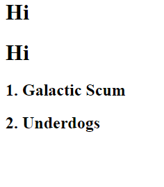

# JavaScript Functions

This project is an exploration of javascript functions.  I built an animal nuggetizer.  I also printed some numbers to the DOM.

## Screenshots

## How to run this project
* Use npm to intall http-server in your terminal:
```sh
npm install -g http-server
```
* Run the server
```sh
hs -p 9999
```
* Open chrome and navigate to:
```
localhost:9999
```

## The rest below is sample markdown

* cat
* dog
* bear

## h2
### h3
#### h4
##### h5
###### h6

1. first thing
1. second thing
1. third thing

sdfsdfsdf
sdfsdfsdf

sdfsfdsdfs


link to something [here](https://www.google.com)

<p>I ama paragraph</p>

<ul>

<li>im a list</li>
<li>yes a list</li>
</ul>

asdoasdasda
